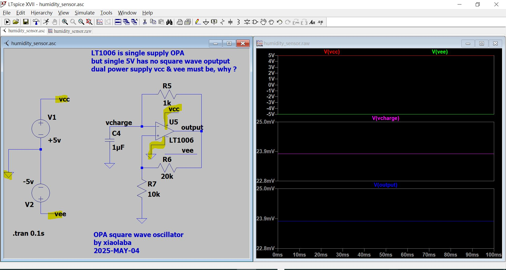
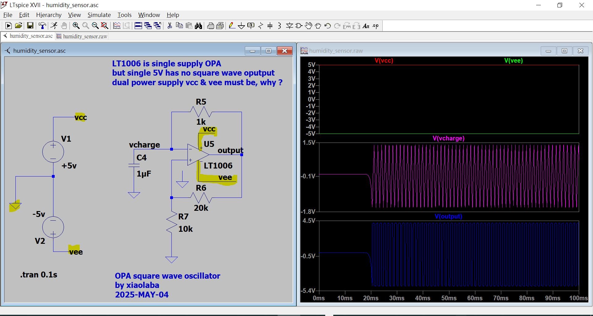
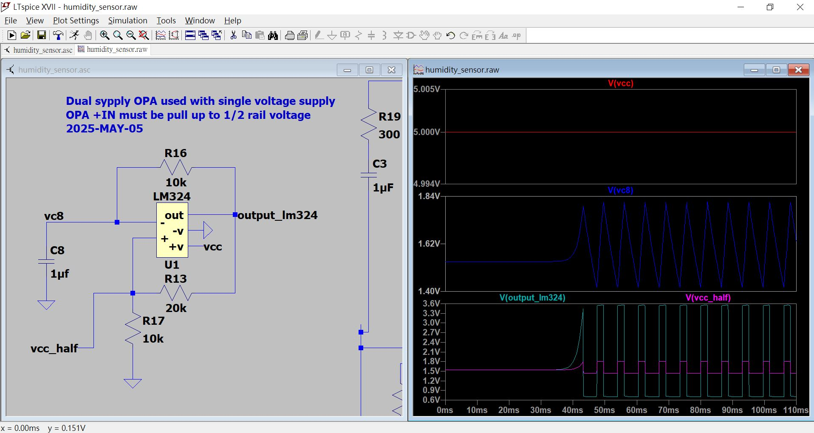
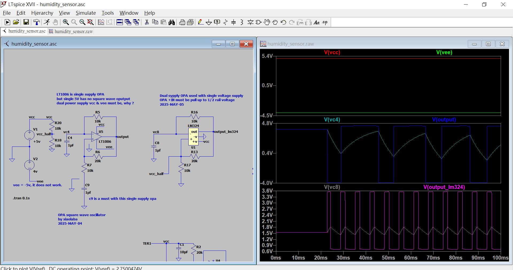
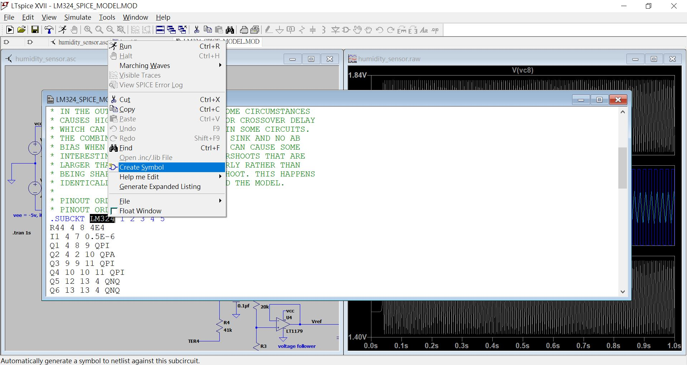
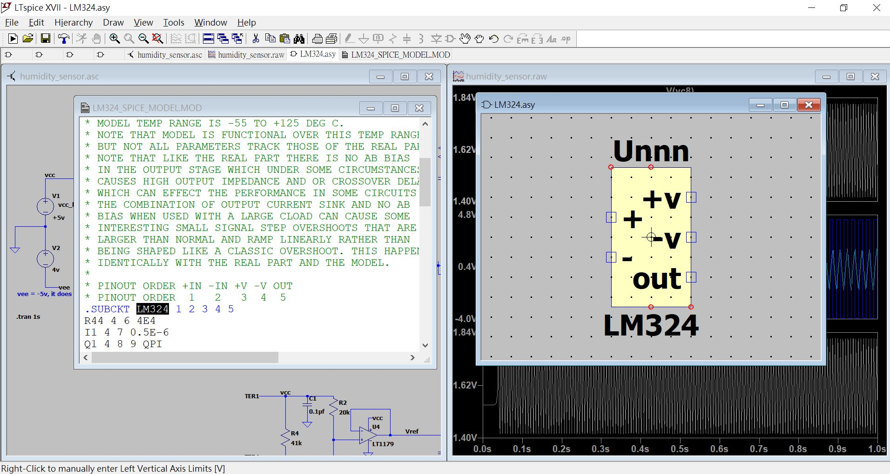
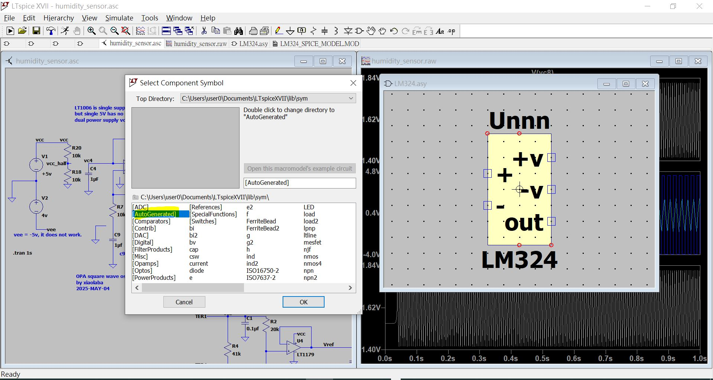

# LTspice_OPA_square_wave_generator
LTspice_OPA_square_wave_generator, single supply OPA LT1006 and dual supply OPA LM324, inverting amplifier and the virtual ground set to half of supply voltage.  

   

   

  

LTspice source code [humidity_sensor.asc](humidity_sensor.asc)  
   

### LM324 SPICE model for simulation,
download SPICE model from on-semi, https://www.onsemi.com/download/models/mod/lm324%20spice%20model%20.mod   
local copy [LM324_SPICE_MODEL.MOD](LM324_SPICE_MODEL.MOD)  
open this file with LTspice XIIV,  
select "LM324", right click, "create symbol"  
LM324.asy will be generated, "%userprofile%\Documents\LTspiceXVII\lib\sym\AutoGenerated"  
go to schmatice, add component, add LM324 for simulation  

1. LM324_add_mod.JPG  
  

2. LM324_edit_symbol.JPG  

3. LM324_select_component.JPG  
  

