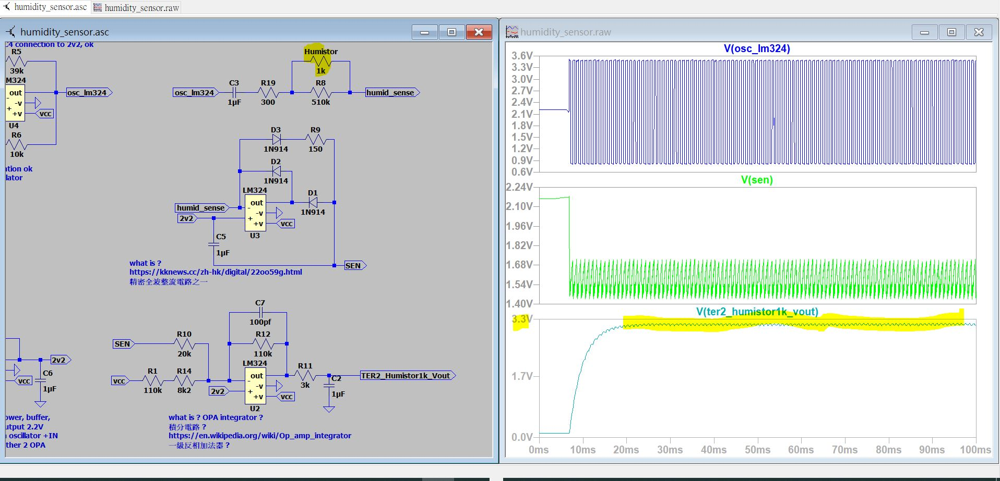
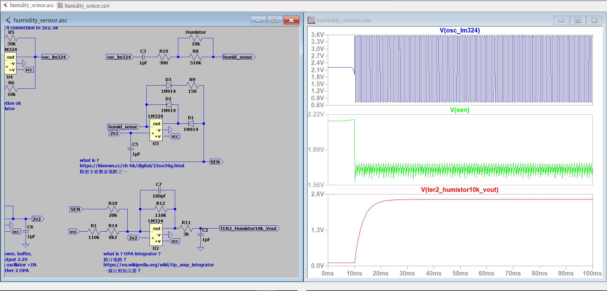
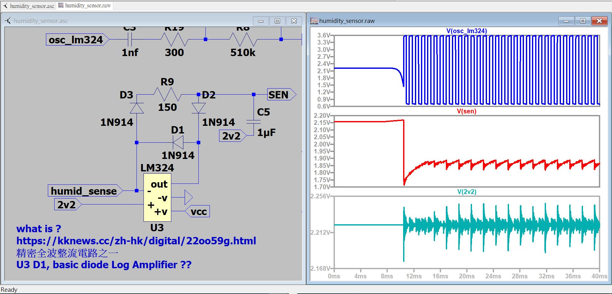

# LTspice_OPA_square_wave_generator
LTspice_OPA_square_wave_generator, single supply OPA LT1006 and dual supply OPA LM324, inverting amplifier and the virtual ground set to half of supply voltage. 
LTspice source code [humidity_sensor.asc](humidity_sensor.asc)  

   

   

  

   

### LM324 SPICE model for simulation,
download SPICE model from on-semi, https://www.onsemi.com/download/models/mod/lm324%20spice%20model%20.mod   
local copy [LM324_SPICE_MODEL.MOD](LM324_SPICE_MODEL.MOD)  
open this file with LTspice XIIV,  
select "LM324", right click, "create symbol"  
LM324.asy will be generated, "%userprofile%\Documents\LTspiceXVII\lib\sym\AutoGenerated"  
go to schmatice, add component, add LM324 for simulation  

1. LM324_add_mod.JPG  
  

2. LM324_edit_symbol.JPG  

3. LM324_select_component.JPG  
  

### complete project, Humistor signal conditioning
[使用說明書-日立除濕機RD-12KE_RD-12KL機種.pdf](使用說明書-日立除濕機RD-12KE_RD-12KL機種.pdf)  
HITACHI_RD-12KL_air_conditioner, HUMI_SENSOR_broad.  
Humistor is driven by AC signal, extends life span, prevents corrosion. quad opAmp LM324 is used.  
U1, square wave generator to drive humistor.
U2, buffer, 2v2 voltage reference for all OPA.  
U3, should be precision rectifier.  
U4, should be integrator for humistor to voltage output.  

   
  

complete source code of LTspice XVII  
[xiaolaba_humidity_sensor.zip](xiaolaba_humidity_sensor.zip)  

### To do more? log amp
LTspice source code [humidity_sensor.asc](humidity_sensor.asc)  
Humistor, log resposne, [aosong_hr202l_apr22_xonlink.pdf](aosong_hr202l_apr22_xonlink.pdf)  
[basic_log_amp_ADI_MT-077.pdf](basic_log_amp_ADI_MT-077.pdf)  
[high_frequency_log_amp_ADI_MT-078.pdf](high_frequency_log_amp_ADI_MT-078.pdf)  

rearanged U3 and D1 and others surrounded component, it looks like basic log amp does...
  
